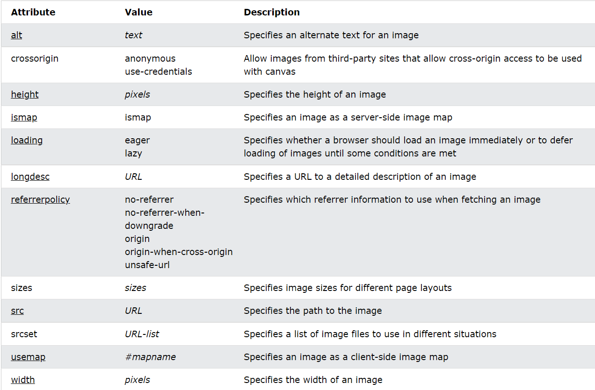

# Definition and Usage of imges

The `` tag is used to embed an image in an HTML page.

Images are not technically inserted into a web page; images are linked to web pages. The `` tag creates a holding space for the referenced image.

The `` tag has two required attributes:

- src - Specifies the path to the image
- alt - Specifies an alternate text for the image, if the image for some reason cannot be displayed

# Practical Information

- 1: Page Title
  The page title appears at the top
  of the browser window or on the
  tab of a browser. It is specified in
  the `<title>` element which lives
  inside the `<head>` element.

- 2: URL / Web Address
  The name of the file is part of
  the URL. Where possible, use
  keywords in the file name.
- 3: Headings
  If the keywords are in a heading
  `<hn>` element then a search
  engine will know that this page is
  all about that subject and give it
  greater weight than other text.
- 4: Text
  Where possible, it helps to
  repeat the keywords in the main
  body of the text at least 2-3
  times. Do not, however, over-use
  these terms, because the text
  must be easy for a human to
  read.
- 5: Link Text
  Use keywords in the text that
  create links between pages
  (rather than using generic
  expressions such as "click here").
- 6: Image Alt Text
  Search engines rely on you
  providing accurate descriptions
  of images in the alt text. This
  will also help your images show
  up in the results of image-based
  searches
