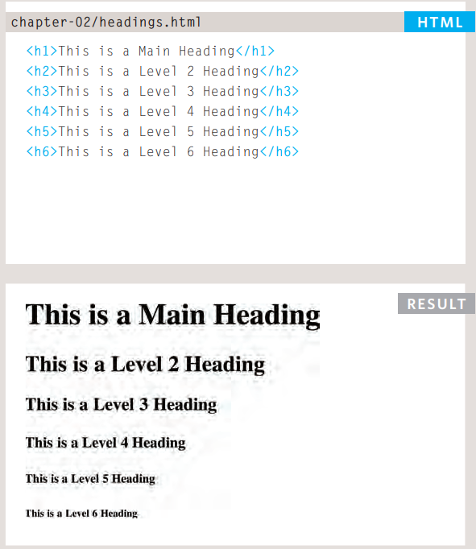
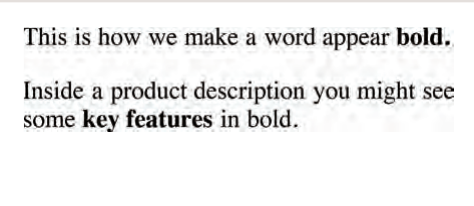
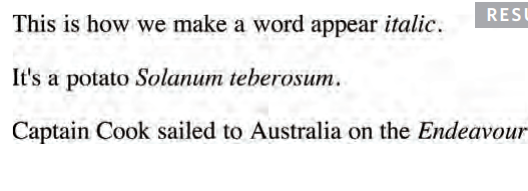

# HTML Headings

HTML defines six levels of headings. A heading element implies all the font changes, paragraph breaks before and after, and any white space necessary to render the heading. The heading elements are H1, H2, H3, H4, H5, and H6 with H1 being the highest (or most important) level and H6 the least.



## Paragraphs

```
<p>: The Paragraph element

The <p> HTML element represents a paragraph. Paragraphs are usually represented in visual media as blocks of text separated from adjacent blocks by blank lines and/or first-line indentation, but HTML paragraphs can be any structural grouping of related content, such as images or form fields
```

## Bold & Italic

```
<b>
By enclosing words in the tags
<b> and </b> we can make
characters appear bold.
The <b> element also represents
a section of text that would be
presented in a visually different
way (for example key words in a
paragraph) although the use of
the <b> element does not imply
any additional meaning
```



```
<i>
By enclosing words in the tags
<i> and </i> we can make
characters appear italic.
The <i> element also represents
a section of text that would be
said in a different way from
surrounding content — such as
technical terms, names of ships,
foreign words, thoughts, or other
terms that would usually be
italicized

```



## Semantic markup

Semantic markup is a way of writing and structuring your HTML (Hypertext Markup Language) so that it reinforces the semantics, or meaning, of the content rather than its appearance. In a broader sense, it means that your site architecture separates presentation from content; essentially saying that HTML is used for structure and CSS is used for the style of your web design.

# What CSS does

CSS is the language for describing the presentation of Web pages, including colors, layout, and fonts. It allows one to adapt the presentation to different types of devices, such as large screens, small screens, or printers. CSS is independent of HTML and can be used with any XML-based markup language.

## How CSS works

A CSS class is an attribute used to define a group of HTML elements in order to apply unique formatting to those elements in CSS. This group can contain more than one type of element. The class attribute doesn't impact the semantic meaning of the HTML document.

## Basic JavaScript Instructions

- COMMENTS :
  You should write comments to explain what your code does.
  They help make your code easier to read and understand.
  This can help you and others who read your code.
- WHAT IS A VARIABLE?
  The script will have to temporarily
  Store bits of information on it
  He needs to do his job. can store this
  data in variables.

## OPERATORS

Expressions rely on things called operators; they allow programmers to
create a single value from one or more values.

```
let x = 5;         // assign the value 5 to x
let y = 2;         // assign the value 2 to y
let z = x + y;     // assign the value 7 to z (5 + 2)
```
