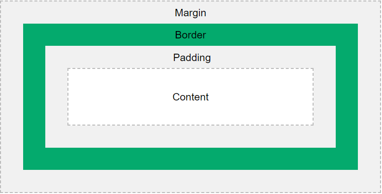

# HTML Lists

HTML lists allow web developers to group a set of related items in lists.

### Two tybes of HTML lists:

```
An unordered HTML list:

Item
Item
Item
Item

An ordered HTML list:

First item
Second item
Third item
Fourth item
```

## HTML List Tags

| tag     | Description                              |
| ------- | ---------------------------------------- |
| ` <ul>` | Defines an unordered list                |
| ` <ol>` | Defines an ordered list                  |
| ` <li>` | Defines a list item                      |
| ` <dl>` | Defines a description list               |
| ` <dt>` | Defines a term in a description list     |
| ` <dd>` | Describes the term in a description list |

# What is the control flow?

In computer programming, control flow or flow of control is the order function calls, instructions, and statements are executed or evaluated when a program is running. Many programming languages have what are called control flow statements, which determine what section of code is run in a program at any time. An example of a control flow statement is an if/else statement

# Why we need the control flow

In computer science, control flow (or flow of control) is the order in which individual statements, instructions or function calls of an imperative program are executed or evaluated. The emphasis on explicit control flow distinguishes an imperative programming language from a declarative programming language.

### example

```
var x = 1;
if (x === 1) {
 window.alert("x is equal to 1.");
}
else {
 window.alert("x is not equal to 1.");
}
```

# What is box model in CSS

In CSS, the term "box model" is used when talking about design and layout.

The CSS box model is essentially a box that wraps around every HTML element. It consists of: margins, borders, padding, and the actual content. The image below illustrates the box model:



## elements of box model in CSS

- Content - The content of the box, where text and images appear
- Padding - Clears an area around the content. The padding is transparent
- Border - A border that goes around the padding and content
- Margin - Clears an area outside the border. The margin is transparent
