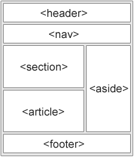

# HTML Links

- HTML links are hyperlinks.

You can click on a link and jump to another document.

## HTML Links - Syntax

The HTML `<a>` tag defines a hyperlink. It has the following syntax:

```html
<a href="url">link text</a>

The most important attribute of the
<a>
  element is the href attribute, which indicates the link's destination. The
  link text is the part that will be visible to the reader.
</a>
```

## Email Links

```html
HTML
<a>
  tag provides you option to specify an email address to send an email. While
  using
  <a>
    tag as an email tag, you will use mailto: email address along with href
    attribute. Following is the syntax of using mailto instead of using http.
    example <a href="mailto: abc@example.com">Send Email</a></a
  ></a
>
```

## HTML Layout Elements

HTML has several semantic elements that define the different parts of a web page:

- `<header>` - Defines a header for a document or a section
- `<nav>` - Defines a set of navigation links
- `<section>` - Defines a section in a document
- `<article>` - Defines an independent, self-contained content
- `<aside>` - Defines content aside from the content (like a sidebar)
- `<footer>` - Defines a footer for a document or a section

* `<details>` - Defines additional details that the user can open and close on demand

- `<summary>` - Defines a heading for the `<details>` element



### HTML Layout Techniques

- CSS framework
- CSS float property
- CSS flexbox
- CSS grid

# Functions is js

A function in JavaScript is similar to a procedure a set of statements that performs a task or calculates a value, but for a procedure to qualify as a function, it should take some input and return an output where there is some obvious relationship between the input and the output.

- To use a function, you must define it somewhere in the scope from which you wish to call it.

## Defining functions

- The name of the function.
- A list of parameters to the function, enclosed in parentheses and separated by commas.
- The JavaScript statements that define the function, enclosed in curly brackets, {...}.

## For example

```js
function square(number) {
return number \* number;
}
```

### Control flow

The control flow is the order in which the computer executes. Code is run in order from the first line in the file to the last line

A typical script in JavaScript or PHP (and the like) includes many control structures, including conditionals, loops and functions. Parts of a script may also be set to execute when events occur.

### JavaScript Operators

```js
* let x = 5; // assign the value 5 to x * let y = 2; // assign the value 2 to y
* let z = x + y; // assign the value 7 to z (5 + 2)
```
