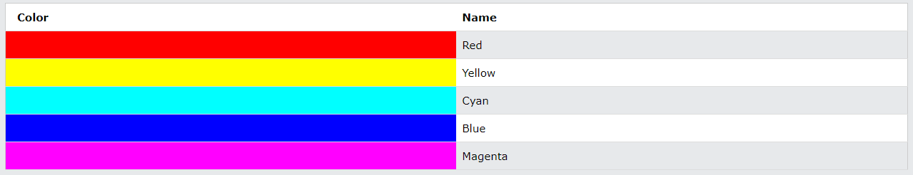

# HTML Images

```html

```

## HTML Images Syntax

- The HTML `` tag is used to embed an image in a web page.

- Images are not technically inserted into a web page; images are linked to web pages.
- The `` tag creates a holding space for the referenced image.

- The `` tag is empty, it contains attributes only, and does not have a closing tag.

#### The `` tag has two required attributes:

- src - Specifies the path to the image.
- alt - Specifies an alternate text for the image.

# CSS Colors

The `<color>` CSS data type represents a color. A `<color>` may also include an alpha-channel transparency value, indicating how the color should composite with its background.


The properties that allow you to control
the appearance of text can be split into
two groups:

- Those that directly affect the font and its appearance
  (including the typeface, whether it is regular, bold or italic,
  and the size of the text)
- Those that would have the same effect on text no matter
  what font you were using (including the color of text and
  the spacing between words and letters)

# JPEG vs PNG vs GIF:

Use JPEG format for all images that contain a natural scene or photograph where variation in colour and intensity is smooth. Use PNG format for any image that needs transparency or for images with text & objects with sharp contrast edges like logos. Use GIF format for images that contain animations.
