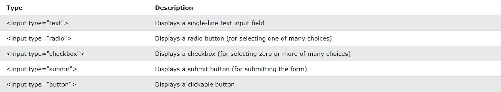

# The `<form>` Element

The HTML `<form>` element is used to create an HTML form for user input

The `<form>` element is a container for different types of input elements, such as: text fields, checkboxes, radio buttons, submit buttons, etc.

## The `<input>` Element

The HTML `<input>` element is the most used form element.

An `<input>` element can be displayed in many ways, depending on the type attribute.


## The `<label>` Element

The `<label>` tag defines a label for many form elements.

The `<label>` element is useful for screen-reader users, because the screen-reader will read out loud the label when the user focus on the input element.

The `<label>` element also help users who have difficulty clicking on very small regions (such as radio buttons or checkboxes) - because when the user clicks the text within the `<label>` element, it toggles the radio button/checkbox.

```html
<form>
  <label for="fname">First name:</label><br />
  <input type="text" id="fname" name="fname" /><br />
  <label for="lname">Last name:</label><br />
  <input type="text" id="lname" name="lname" />
</form>
```

## HTML Events

An HTML event can be something the browser does, or something a user does.

Here are some examples of HTML events:

- An HTML web page has finished loading
- An HTML input field was changed
- An HTML button was clicked
  Often, when events happen, you may want to do something.

JavaScript lets you execute code when events are detected.

HTML allows event handler attributes, with JavaScript code, to be added to HTML elements.

With single quotes: `<element event='some JavaScript'>`
