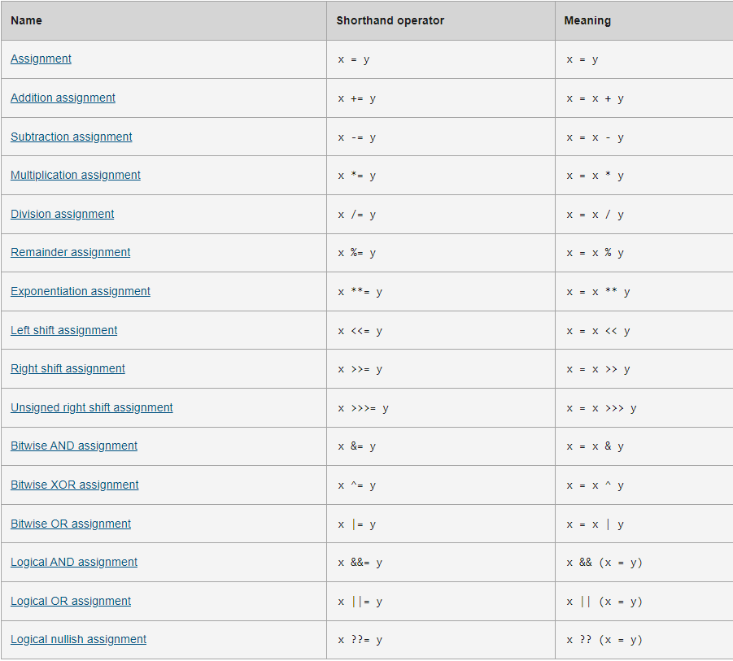

# Loops and iteration
Loops offer a quick and easy way to do something repeatedly. There are many different kinds of loops, but they all essentially do the same thing: they repeat an action some number of times.and The various loop mechanisms offer different ways to determine the start and end points of the loop.

#### this way as a loop:
for (let step = 0; step < 5; step++) {
  // Runs 5 times, with values of step 0 through 4.
  console.log('Walking east one step');
}
## The statements for loops provided in JavaScript are:

* for statement
* do...while statement
* while statement
* labeled statement
* break statement
* continue statement
* for...in statement
* for...of statement
### operators
This will describes the operators and contains information about operator precedence.
