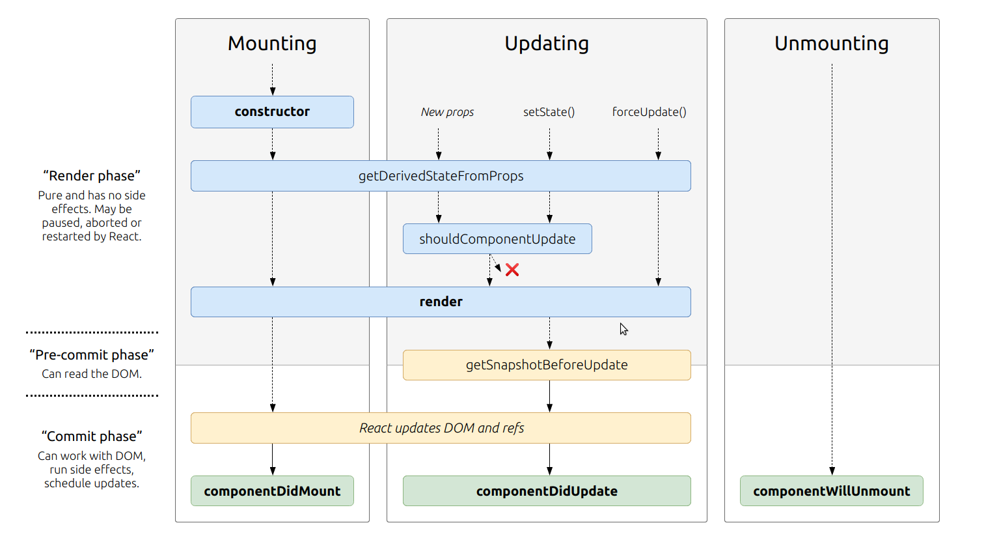

# State and Props

# What is the very first thing to happen in the lifecycle of React?

### Constructor().

# Based off the diagram, what happens first, the ‘render’ or the ‘componentDidMount’?

The render happens first then the componentDidMount.

# Put the following things in the order that they happen: componentDidMount, render, constructor, componentWillUnmount, React Updates.

- constructor
- render
- React Updates
- componentDidMount
- componentWillUnmount
